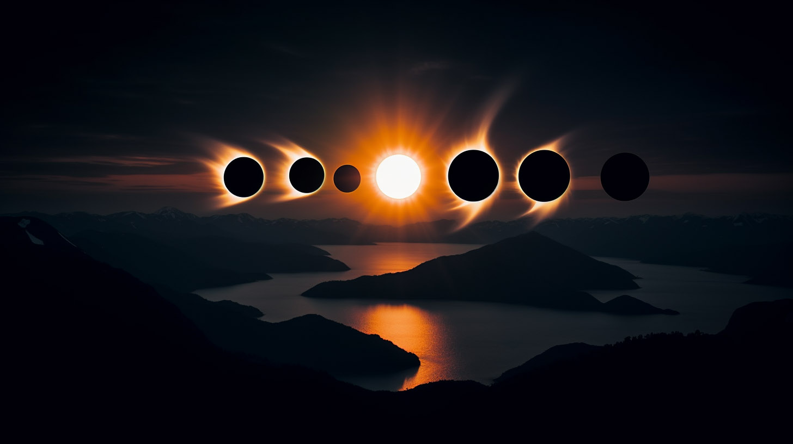
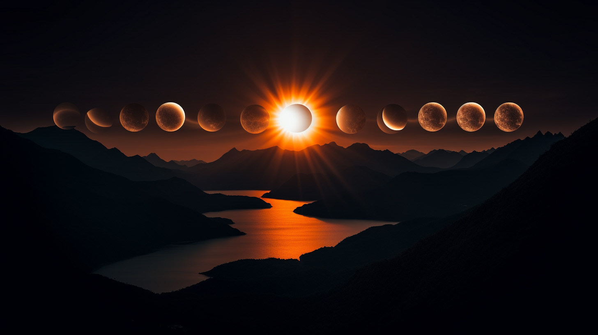

# BK TimeLapsing

### Time passing through my studio window in Brooklyn

I wanted to to catch the leaves changing this year, but ran out of time. There are plenty of conventional shots I've taken throughout this autumn to compensate. I'm looking forward to shooting during snow storms.

For privacy concerns, it's not likely that I'll share the images or videos anywhere in a personally identifiable manner. It'll be out there, but tracing it back to me will be up to you. And I'm not going easy on you.

## Astral

I leveraged [Astral](https://astral.readthedocs.io/en/latest/#) to get the times of the sun's positions each day.

A shot is taken every 10 seconds from 20 minutes before dawn to 20 mins after dusk. Not sure yet if that fully covers first and last light, so will season to taste.

## WIP

I'll likely leverage FFmpeg to assemble videos. I'm not sure yet in what other ways I'll work with the data. 

I just wrote the bit about snow storms above. And realized that I'll want to be shooting at night during storms. I may even want to be shooting while there's snow on the ground.

So obviously there are things I'm going to need to experiment with once I start shooting. I've got an IR camera as well. Then there's the bit about getting proper exposures and what images that results in.

## Images

Images courtesy of Midjourney

### Prompt:

>multiple exposure timelapse of a full solar eclipse as viewed from on top of a mountain overlooking a stunning norwegian fjord, rich and saturated colors